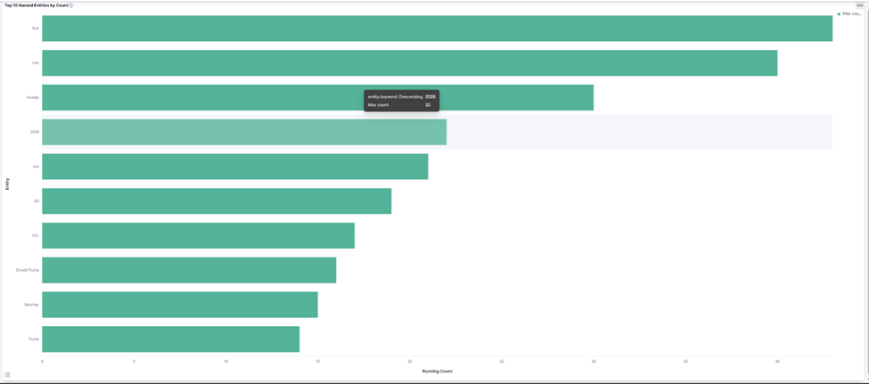
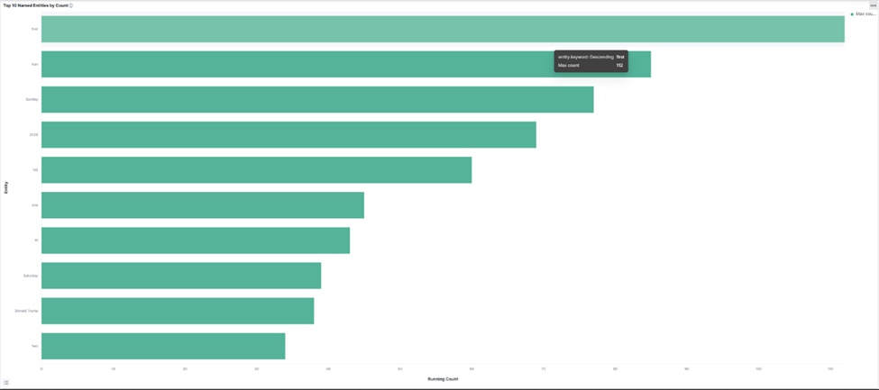
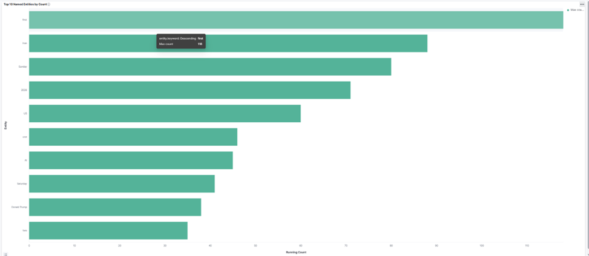
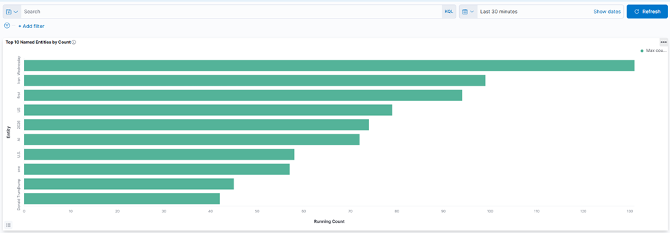

# CS 6350 Big Data Management and Analytics 
## Assignment 3: 
> Kafka Spark Structure Streaming and GraphX/Graphframes

---

## Part 1: Spark Structured Streaming with NewsAPI and Kafka

### Prerequisites

- Docker Desktop (with WSL2 integration enabled)
- Python 3.8+
- Apache Spark 3.5.x with `spark-submit` on your PATH
- A NewsAPI key (free tier at https://newsapi.org)

Install Python dependencies:

```bash
pip install -r requirements.txt
python -m spacy download en_core_web_sm
```

Set your NewsAPI key as an environment variable (or leave the fallback in `news_producer.py`):

```bash
export API_KEY=your_newsapi_key_here
```

---

### Step 1 — Start Kafka (and optionally the full ELK stack)

From the project directory in WSL:

```bash
# Kafka only (for producer + Spark):
docker compose up -d zookeeper kafka

# Full stack including Elasticsearch, Logstash, Kibana:
docker compose up -d
```

Wait for containers to be healthy:

```bash
docker compose ps
```

---

### Step 2 — Run the NewsAPI Producer

Opens a terminal and runs the producer. It polls NewsAPI every 60 seconds, rotating through keyword queries (technology, politics, economy, sports, etc.) and publishes each unique article as a JSON record to Kafka topic `news-raw`.

```bash
python news_producer.py localhost:9092
```

Expected output:
```
[producer] Connected to Kafka at localhost:9092
[producer] Polling NewsAPI every 60s → topic 'news-raw' …
[producer] 15:06:30 UTC  query=technology  sent= 99  total_seen=  99  sleeping 60s …
```

---

### Step 3 — Run the NER Spark Streaming Job

In a second terminal, submit the PySpark job. It reads from `news-raw`, applies spaCy NER to each article, maintains running entity counts, and publishes results to Kafka topic `ner-counts` every 30 seconds.

```bash
# Clear any stale checkpoint first (required after Kafka topic resets):
rm -rf /tmp/checkpoint_ner_counts

spark-submit \
  --packages org.apache.spark:spark-sql-kafka-0-10_2.12:3.5.0 \
  ner_spark_streaming.py localhost:9092
```

Expected output every 30 seconds:
```
=================================================================
  Trigger 1  |  15:08:00 UTC  |  142 unique entities
=================================================================
  LABEL           ENTITY                                      COUNT
  ------------------------------------------------------------
  DATE            Wednesday                                   127
  GPE             Iran                                         91
  PERSON          Trump                                        44
  ...
  Flushed 142 entity-count messages to 'ner-counts'
```

---

### Step 4 — Set Up Kibana Dashboard (optional)

Once the Spark job has fired at least one trigger:

```bash
python kibana_setup.py
```

This automatically creates an Elasticsearch index mapping, Kibana index pattern, horizontal bar chart visualization, and dashboard. The script prints the direct dashboard URL on completion.

Open Kibana at http://localhost:5601, navigate to the printed dashboard URL, and set the time picker to **All time** to view all accumulated entity counts.

---

### Part 1 screenshots — top 10 named entities at 15-minute intervals

All four bar-plot snapshots are stored in [`part1results/`](part1results/).

#### After 15 minutes


#### After 30 minutes


#### After 45 minutes


#### After 60 minutes


### File Reference

| File | Description |
|---|---|
| `news_producer.py` | Polls NewsAPI and publishes articles to Kafka `news-raw` |
| `ner_spark_streaming.py` | PySpark job: NER extraction and running counts → `ner-counts` |
| `kibana_setup.py` | Auto-creates Kibana index pattern, visualization, and dashboard |
| `docker-compose.yml` | ZooKeeper, Kafka, Elasticsearch, Logstash, Kibana |
| `logstash/pipeline/logstash.conf` | Logstash pipeline: `ner-counts` → Elasticsearch |
| `requirements.txt` | Python dependencies |
| `part2.py` | Single spark-submit entrypoint for Part 2 (2.1 + 2.2 + 2.3a–e) |


## Part 2: GraphFrames analysis of the musae-github network
See the **Part 2 — Additional details** and **Part 2 outputs and analysis** sections below for full details.

Summary of the workflow:

```bash
spark-submit \
  --packages graphframes:graphframes:0.8.3-spark3.5-s_2.12 \
  part2.py
```

The single entrypoint downloads the SNAP musae-github archive, builds a
property GraphFrame (37,700 vertices, 578,006 directed edges = 2 × 289,003
undirected edges), and runs all five queries from Section 2.3:

| Query | Output file                                | What it computes                                                |
|-------|--------------------------------------------|-----------------------------------------------------------------|
| 2.3a  | `part2_output/2_3a_top_outdegree.txt`      | Top 5 vertices by outdegree                                     |
| 2.3b  | `part2_output/2_3b_top_indegree.txt`       | Top 5 vertices by indegree                                      |
| 2.3c  | `part2_output/2_3c_top_pagerank.txt`       | Top 5 vertices by PageRank (resetProbability=0.15, maxIter=10)  |
| 2.3d  | `part2_output/2_3d_top_components.txt`     | Top 5 connected components by vertex count                      |
| 2.3e  | `part2_output/2_3e_top_triangles.txt`      | Top 5 vertices by triangle count (ties broken with seeded rand) |


### Part 2 — Additional details

The following sections are merged in from the old `p2/README.md` so the
project has a single readme.

### Part 2 prerequisites

Tested with Ubuntu on WSL2. Any Spark 3.5 + Python 3.10+ environment works.

1. **Java 11** (Spark 3.5 runs on Java 8/11/17; 11 is the easy choice):
   ```bash
   sudo apt-get install openjdk-11-jdk
   ```
2. **Python packages** (PySpark + deps):
   ```bash
   pip install pyspark==3.5.0
   ```
   GraphFrames' Python bindings ship inside the Maven package and are
   added to `PYTHONPATH` automatically by `spark-submit --packages`.
3. **Outbound network access** — the script pulls the dataset from
   `snap.stanford.edu` and the GraphFrames jar from Maven Central on first
   run.

### Optional environment variables

| Variable        | Purpose                                                 | Default                                       |
|-----------------|---------------------------------------------------------|-----------------------------------------------|
| `P2_WORK_DIR`   | Cache dir for the downloaded dataset + CC checkpoints   | fresh `tempfile.mkdtemp()`                    |
| `P2_OUTPUT_DIR` | Where query outputs are written                         | `./part2_output` relative to cwd              |

Example — reuse a cached download between runs:

```bash
export P2_WORK_DIR=~/.cache/cs6350-p2
spark-submit --packages graphframes:graphframes:0.8.3-spark3.5-s_2.12 part2.py
```

### Expected sanity numbers

After the run you should see in the driver log:

- Vertex count: **37,700**
- Undirected edge count: **289,003**
- Directed edge count: **~578,006** (≈ 2 × undirected; any deviation is the
  defensive `.distinct()` absorbing pre-existing symmetric pairs)
- `|V|`, `|E|` on the GraphFrame matching the numbers above.

Runtime is roughly **5–15 minutes** end-to-end on a laptop. PageRank
finishes quickly; Connected Components and (especially) Triangle Count are
the slow parts. The job is done when you see
`[done] All query outputs written under: ...` in the log.

### Notes on the results

- **Output columns** — every result file has columns `id`, `name`, and the
  query-specific metric (`outDegree`, `inDegree`, `pagerank`,
  `num_vertices`, or `triangle_count`). The vertex `ml_target` attribute
  is carried in the GraphFrame (so 2.2 still satisfies "property graph")
  but intentionally omitted from the result files because the spec doesn't
  ask for it.
- **2.3a vs 2.3b** — since musae-github is undirected and we materialise
  both directions, every vertex has `indegree == outdegree`. The two
  ranking files therefore show the same top 5. That's the correct answer
  given the spec requires the undirected → 2-directed conversion; the
  files are kept separate because the spec asks for both queries as
  independent outputs.
- **2.3c PageRank** — run with `resetProbability=0.15` (canonical 0.85
  damping factor) and `maxIter=10`. 10 iterations give stable top-k
  rankings for this graph size. Note: GraphFrames returns *unnormalised*
  PageRank scores — every vertex starts with rank 1 (not 1/N), so the sum
  over all vertices is ≈ N = 37,700 and individual scores can be much
  greater than 1. The ranking is identical to the textbook normalised
  form; divide by 37,700 if you want probability-style values in `[0, 1]`.
- **2.3d Connected Components** — requires a checkpoint directory, which
  the script sets up automatically under `P2_WORK_DIR/checkpoints`.
- **2.3e Triangle Count** — ties are broken with a seeded `F.rand()`
  (seed = 42) so the output is reproducible across runs but randomised
  within tied triangle counts, as the spec allows.

---

## Part 2 outputs and analysis

Musae-Github Network Analysis:

We analyzed the **musae-github** social network from SNAP with Spark
GraphFrames.

- Dataset page: https://snap.stanford.edu/data/github-social.html
- Archive (downloaded automatically at runtime): https://snap.stanford.edu/data/git_web_ml.zip
- ~37,700 GitHub developers, ~289,003 mutual-follower edges (undirected),
  each doubled into two directed edges per the assignment spec.
- Tested with Ubuntu on WSL2. Any Spark 3.5 + Python 3.10+ environment works.

### 2.3a Top 5 nodes by outdegree (outgoing edges)

```
id    | name              | outDegree
------+-------------------+----------
31890 | dalinhuang99      | 9458
27803 | nfultz            | 7085
35773 | addyosmani        | 3324
19222 | Bunlong           | 2958
13638 | gabrielpconceicao | 2468
```

> Very simple count of the number of accounts these users follow a.k.a.
> the outdegree in this case. This lists the top 5 users with most
> outgoing connections. From this we can also infer they are active users,
> part of a large community on GitHub.

### 2.3b Top 5 nodes by indegree (incoming edges)

```
id    | name              | inDegree
------+-------------------+---------
31890 | dalinhuang99      | 9458
27803 | nfultz            | 7085
35773 | addyosmani        | 3324
19222 | Bunlong           | 2958
13638 | gabrielpconceicao | 2468
```

> Very simple count of the number of followers each has a.k.a. the
> indegree in this case. These are the most popular users in terms of
> follower count or well-known and well connected users.

### 2.3c Top 5 nodes by PageRank (resetProbability=0.15, maxIter=10)

```
id    | name              | pagerank
------+-------------------+-------------------
31890 | dalinhuang99      | 634.0502986779188
27803 | nfultz            | 433.4045041751695
35773 | addyosmani        | 190.0493832173293
19222 | Bunlong           | 178.00658569996676
13638 | gabrielpconceicao | 147.84127656784105
```

> Ran the PageRank algorithm to determine the most well-known / popular /
> influential GitHub users based on their connections (follows/following
> vs followers). Here we are not just worried about the count of their
> connections but their value or influence as well. High scores indicate a
> well connected user that is also well connected to other influential
> users. In other words, these users are part of a very popular group or
> highly influential and close-knit / well-known community of GitHub —
> like an upper echelon of its users by account.

### 2.3d Top 5 connected components by vertex count

```
component | num_vertices
----------+-------------
0         | 37700
```

> The number of components is 1 since all users are connected to each
> other at least once in this graph and can be reachable from each other.
> Connected components are parts or subgraphs that have a connection
> between all of their nodes regardless of the length of the paths to
> reach each. If a subgraph doesn't have any connection to another
> subgraph, they are separate components. However, in our case, the
> GitHub community seems to be all connected overall.

### 2.3e Top 5 vertices by triangle count (ties broken randomly)

```
id    | name              | triangle_count
------+-------------------+---------------
27803 | nfultz            | 80286
31890 | dalinhuang99      | 63205
19222 | Bunlong           | 27873
35773 | addyosmani        | 22758
13638 | gabrielpconceicao | 19762
```

> Triangle counts are counts of 3 mutually connected individual GitHub
> accounts (e.g. A, B, C have connections A↔B, A↔C, & B↔C). These users
> have the most triangle count connections or, in other words, have tight
> community connections to fellow GitHub users and not just a lot of
> followers.


---

Submission contents
Code: all the files listed above.
Part 1 snapshots: `part1results/15mins.png`, `part1results/30mins.png`, `part1results/45mins.png`, `part1results/60mins.png`.
Part 2 outputs: `part2_output/2_3*.txt` (five files).
Reports / READMEs: this file (single readme covering both parts).

---